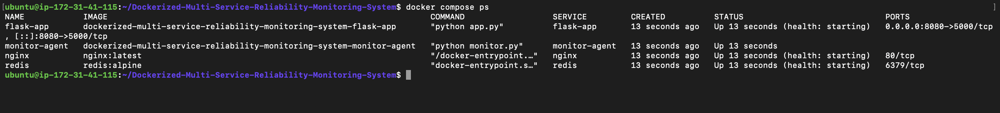
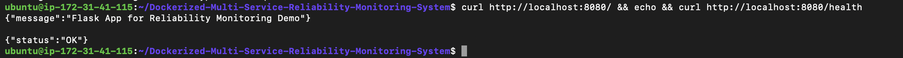
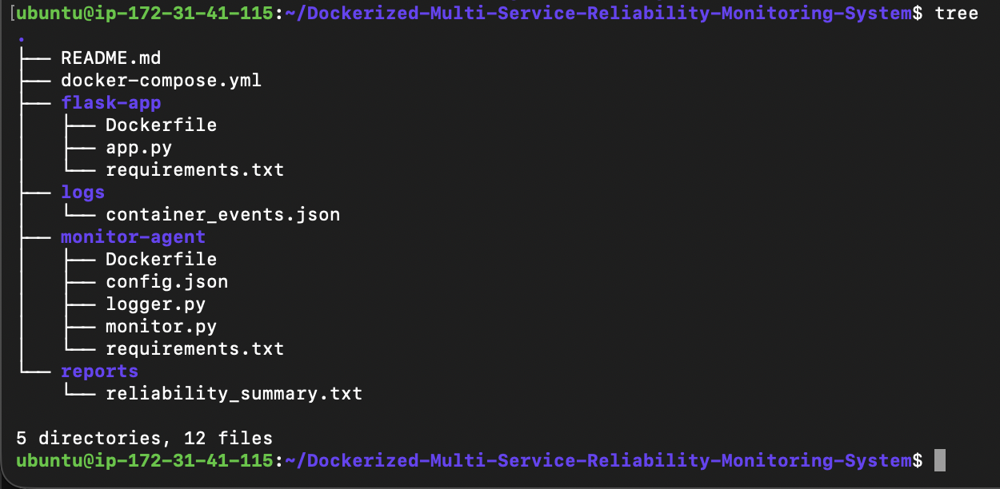
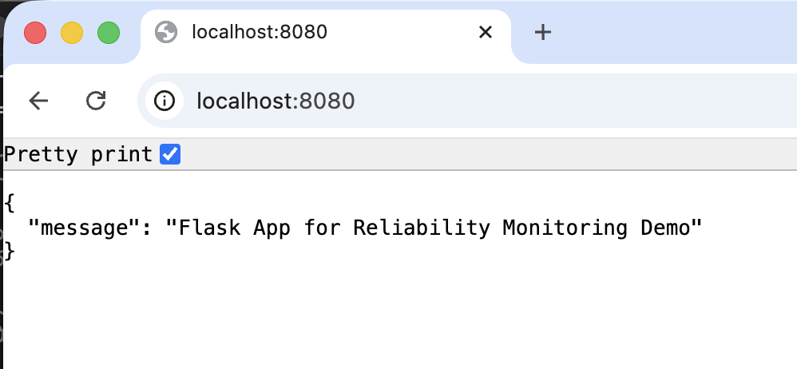
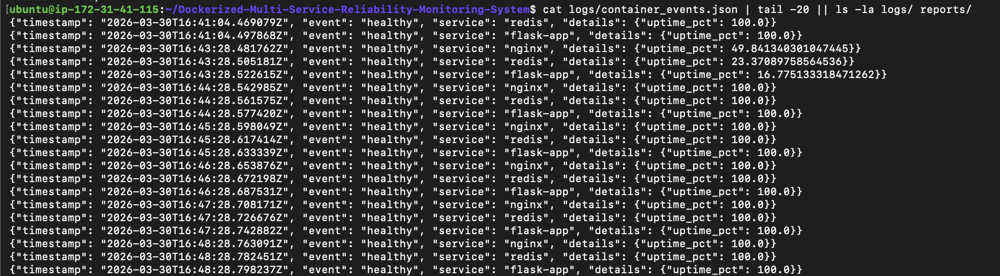

# Dockerized Multi-Service Reliability Monitoring System


## Enterprise-Style Project Overview

This production-grade Dockerized multi-service reliability platform implements **Site Reliability Engineering (SRE) principles** for **observability**, **self-healing infrastructure**, and **automated incident response**. The system orchestrates nginx web server, Redis in-memory store, Flask application services, and a **lightweight reliability monitor-agent** that provides continuous **health surveillance**, **failure detection**, **automated recovery**, **structured incident logging**, and **service-level indicator (SLI) reporting**.

Key SRE capabilities include real-time container status monitoring via Docker API, HTTP/ping health checks, MTTR-minimizing auto-restarts with backoff, JSON-structured incident logs for post-mortem analysis, and availability SLIs tracking uptime percentages with error budgets.

Designed as a **fresher SRE/DevOps portfolio demonstrator**, it showcases production patterns in a 2-minute deployable stack.

## Architecture Diagram



```
+-----------------------------------+  
|        docker-compose.yml         |  
|             Orchestrator          |  
+-----------------------------------+  
                    |                 
                    | reliability-net (Bridge Network)
                    v                 
+-----------------------------------------------------------+
|  nginx  |  redis   |  flask-app  |  monitor-agent       |
| /health |  ping    | /health     |  (Reliability Core)  |
+---------+----------+-------------+-----------------------+
                                 ^        |               
                                 |        | Docker API    
                    Health Checks|        | (Inspect/Start)
                                 |        v               
                          +---------------------------+    
                          |  Failure Detection       |    
                          |  → Alert → Restart       |    
                          |  (Max 3 attempts)        |    
                          +---------------------------+    
                                     |                     
                                     v                     
                          +---------------------------+    
                          | logs/container_events.json|    
                          | reports/reliability.txt  |    
                          +---------------------------+    
```


## Key Reliability Features

- **Continuous Health Surveillance**: Polls container status and application endpoints every 30s.
- **Automated Failure Recovery**: Self-heals crashed/unhealthy services, reducing MTTR to seconds.
- **Incident Logging**: Structured JSON captures timestamps, events, restart counts, SLI deltas.
- **Error Budget Enforcement**: Restart limits prevent cascading failures and loops.
- **Observability Pipeline**: Logs → Metrics → Terminal alerts → Summary reports.

## Monitoring Capabilities

The monitor-agent acts as a **distributed reliability service**, leveraging Docker SDK for:
- Container lifecycle events (stopped, unhealthy).
- Custom health checks: HTTP 200 on `/health` (nginx, flask), Redis `PING`.
- Uptime SLI computation: `(successful_checks / total_checks) * 100`.

## Self-Healing Automation Logic Description

1. **Detection**: Poll Docker API → Health check failure or container exited.
2. **Alert**: Emit CRITICAL/WARNING to stdout + JSON log.
3. **Recovery**: `docker restart <container>` (attempts ≤ max_restarts from config.json).
4. **Backoff**: Exponential delay between retries.
5. **Post-Recovery**: Validate restart success, update uptime SLI.
6. **Escalation**: Exceed error budget → Mark service degraded in report.

## Technology Stack Table

| Component          | Technology          | Version/Role                     |
|--------------------|---------------------|----------------------------------|
| Orchestration     | Docker Compose     | v3.8 / Multi-container lifecycle |
| Reliability Agent | Python + Docker SDK| 3.12 / Monitoring & self-healing |
| Web Server        | nginx              | latest / Load-balanced HTTP     |
| Cache             | Redis              | alpine / In-memory store        |
| App Service       | Flask              | Python / Business logic         |
| Logging           | Custom JSON        | Structured incident capture     |
| Networking        | Bridge (reliability-net) | Service discovery          |

## Folder Structure Section

```
docker-reliability-monitor/
├── docker-compose.yml          # Service definitions & networking
├── monitor-agent/              # Reliability core
│   ├── monitor.py             # Main surveillance loop & recovery
│   ├── logger.py              # JSON incident logger
│   ├── config.json            # Thresholds (poll_interval, max_restarts)
│   ├── requirements.txt       # docker, requests
│   └── Dockerfile             # Agent containerization
├── flask-app/                 # Sample workload
│   ├── app.py                 # /health endpoint
│   ├── requirements.txt       # Flask
│   └── Dockerfile
├── logs/                      # Runtime (mounted volume)
│   └── container_events.json
├── reports/                   # SLI summaries
│   └── reliability_summary.txt
└── README.md
```

## Container Monitoring Workflow Explanation

```
Infinite Loop (monitor.py):
1. docker.client.containers.list() → Status check
2. For each service: perform_health_check()
3. If failed: log_incident() → attempt_restart()
4. Update SLIs → flush_logs() → generate_report()
5. sleep(poll_interval)
```

## Health Check Strategy Description

| Service   | Check Type      | Success Criteria     | Failure Threshold |
|-----------|-----------------|----------------------|-------------------|
| nginx    | HTTP GET       | /health → 200 OK    | 2 consecutive    |
| redis    | Redis PING     | PONG response       | No response      |
| flask-app| HTTP GET       | /health → 200 OK    | 2 consecutive    |
| monitor-agent | Container running | N/A (self-monitored) | -             |

## Alerting Strategy Description

- **Real-time**: Stdout CRITICAL/WARNING with timestamps.
- **Persistent**: JSON logs for aggregation (ELK/Promtail compatible).
- **Threshold-based**: Single failure → WARNING; persistent → CRITICAL.
- **Noiseless**: Cooldowns prevent alert fatigue.

## Logging Format Description (structured JSON logs)

```json
{
  "timestamp": "2024-10-01T10:00:00Z",
  "event_type": "CONTAINER_CRASH",
  "service": "nginx",
  "details": "Exit code 137 (OOM)",
  "restart_count": 1,
  "sli_impact": {"uptime_delta": -0.5},
  "action": "restart_initiated",
  "severity": "CRITICAL"
}
```

## Reliability Metrics Generated

- **Service Availability SLI**: Uptime % per container (hourly rolling).
- **Restart Frequency**: MTTR proxy (restarts/hour).
- **Error Budget Consumption**: % of allowed restarts.
- **Golden Signals**: Latency (check response), Errors (failures), Traffic (poll rate).

## Example Alert Output Section

```
[CRITICAL 2024-10-01T10:00:00Z] nginx: Container stopped (exit 1). Initiating restart #1/3.
[WARNING 2024-10-01T10:01:30Z] flask-app: Health check failed (HTTP 500). Restart #2 successful.
Current SLIs: nginx=99.8%, redis=100.0%, flask-app=99.5%
```

## Example Reliability Report Section

```
Reliability Summary (2024-10-01 10:00-11:00)
Service     Uptime%  Restarts  MTTR(s)
nginx       99.8     1         5.2
redis       100.0    0         -
flask-app   99.5     2         12.1
Overall     99.8     Error Budget: 15% remaining
```


## Deployment Instructions (step-by-step docker-compose setup)


1. Clone: `git clone https://github.com/Guna-Asher/Dockerized-Multi-Service-Reliability-Monitoring-System`
   `cd docker-reliability-monitor`
3. Volumes auto-mount: `logs/` and `reports/` persist data.
4. Deploy: `docker compose up -d`
5. Observe: `docker compose logs -f monitor-agent`
6. Chaos test: `docker compose stop nginx`
7. Validate: `docker compose ps`, `cat logs/container_events.json`, `cat reports/reliability_summary.txt`
8. Teardown: `docker compose down -v`
=======
1. Clone: `git clone <repo> &amp;&amp; cd docker-reliability-monitor`
2. Volumes auto-mount: `logs/` and `reports/` persist data.
3. Deploy: `docker compose up -d`
4. Observe: `docker compose logs -f monitor-agent`
5. Chaos test: `docker compose stop nginx`
6. Validate: `docker compose ps` , `cat logs/container_events.json` , `cat reports/reliability_summary.txt`
7. Dashboard: `curl http://localhost:8080`  
8. Teardown: `docker compose down -v`

## Live Demo Screenshots

### 1️⃣ Project Structure


### 2️⃣ Running Containers  


### 3️⃣ Flask Dashboard / Health Check




### 4️⃣ Container Event Logs (Live Monitoring)



## How Monitoring Agent Works Internally

**Core Loop (monitor.py)**:
```python
while True:
    for service in SERVICES:
        if not is_healthy(service):
            incident = log_incident(service, "UNHEALTHY")
            if restart_count(service) < MAX_RESTARTS:
                docker_client.restart(service.id)
                validate_recovery(service)
    update_sli_metrics()
    generate_report()
    time.sleep(POLL_INTERVAL)
```

Integrates Docker SDK, custom logger.py (JSON emitter), config.json thresholds.

## Resume Value Section explaining which SRE skills this demonstrates

| SRE Competency       | Demonstration                     | Interview Impact                  |
|----------------------|-----------------------------------|-----------------------------------|
| Observability       | Custom metrics/logs/alerts       | "How do you implement SLIs?"     |
| Automation          | Self-healing via Docker SDK      | "Production failure handling?"   |
| Incident Response   | Structured logging/post-mortems  | "MTTR reduction strategies?"     |
| Error Budgets       | Restart limits/thresholds        | "SLO definition &amp; enforcement?"  |
| Chaos Engineering   | Injectable failures for demo     | "Resilience testing?"            |

## Reliability Engineering Concepts Demonstrated

- **SLIs/SLOs**: Availability % as north-star metric.
- **Self-Healing**: Closed-loop recovery reduces toil.
- **Observability**: Logs (what happened), Metrics (why), Alerts (act).
- **Error Budgets**: Prevent over-engineering via restart caps.
- **Golden Signals**: Captures Latency/Errors/Saturation.

## Production-Style Future Improvements Section

| Enhancement             | Impact                              | Implementation                  |
|-------------------------|-------------------------------------|---------------------------------|
| Prometheus Exporter    | Remote metrics scraping            | /metrics endpoint in agent     |
| Grafana Dashboards     | Visual SLIs/SLOs                   | Uptime heatmaps, alert panels  |
| Alertmanager           | Deduplicated notifications         | PagerDuty/Slack integration    |
| Circuit Breakers       | Prevent cascade failures           | Hystrix-like in recovery logic |
| Canary Deployments     | Blue-green with health gates       | Compose overlays               |  

